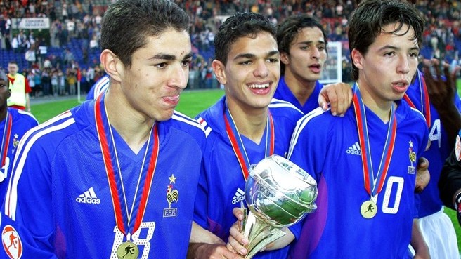
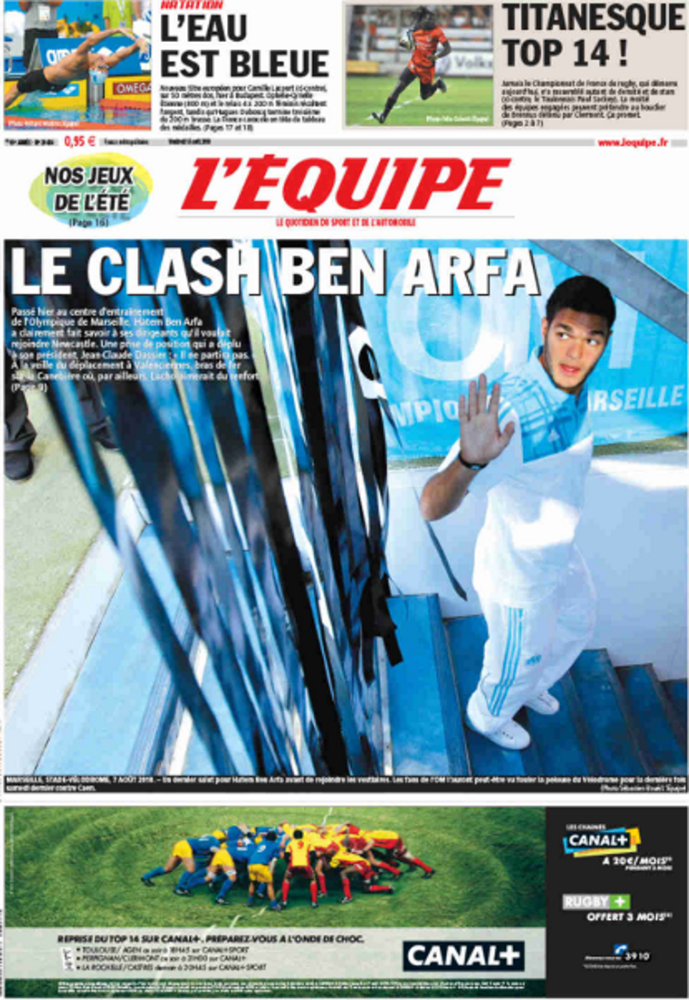
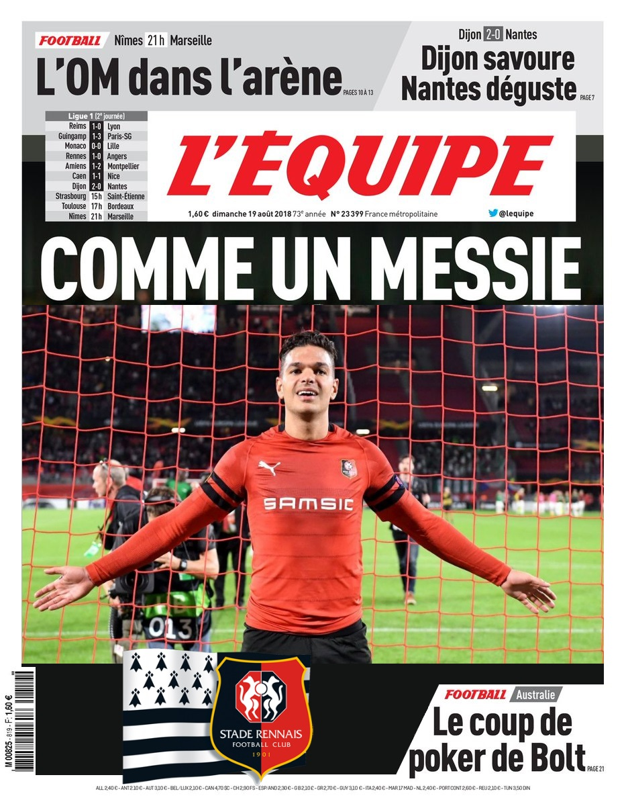
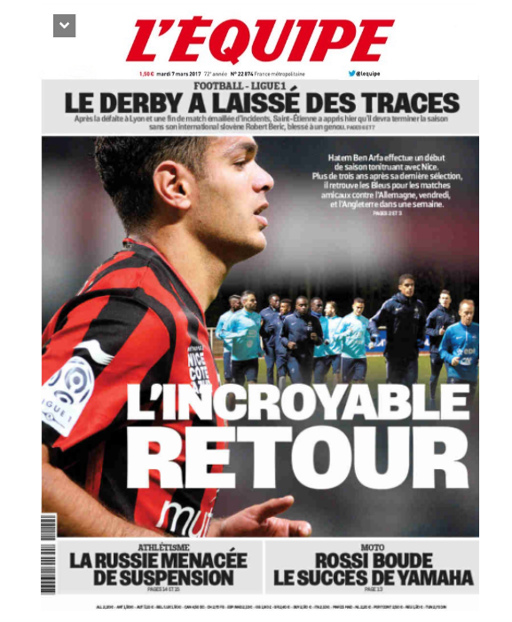
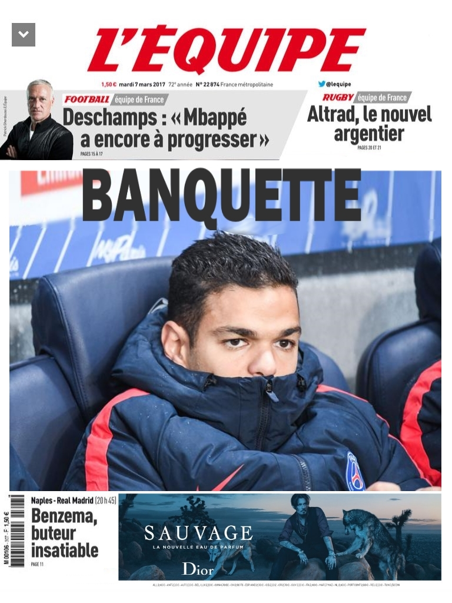
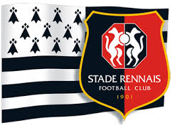

# Rétro Hatem

#### L'idée de cette rétro vient d'un défi qui m'a été posé par un membre de l'équipe. Quand j'ai demandé s'ils préféraient une rétro à thème (on focus sur un sujet) ou une rétro généraliste, il m'a dit "A thème". Mais pour lui, en grand fan de foot et du Stade Rennais, ça signifiait "Hatem" (Ben Arfa). Challenge accepted...

### Intro

Je connais très bien le foot. J'ai donc pu me faire plaisir sur cette rétro, en jouant sur les rivalités entre équipes (moi Nantes, lui Rennes), et les "dossiers" du joueur. 

### Corps de la rétro
Les catégories sont classiques mais illustrées par des fausses unes de l'équipe que j'ai créées :

- **Arrêter** 

- **Commencer** 

- **Continuer** 

- **Moins de** 

### Conclusion de la rétro
Un petit quizz Kahoot sur Ben Arfa en fin de rétro, avec beaucoup de chambrage !

