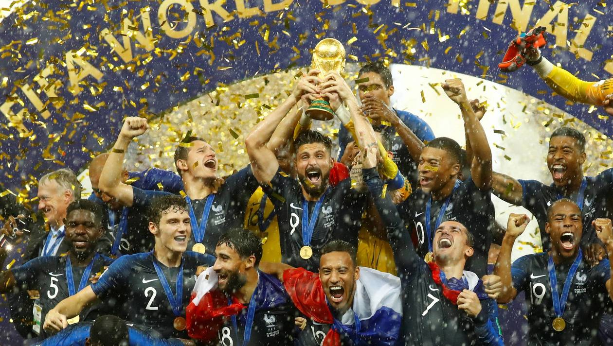
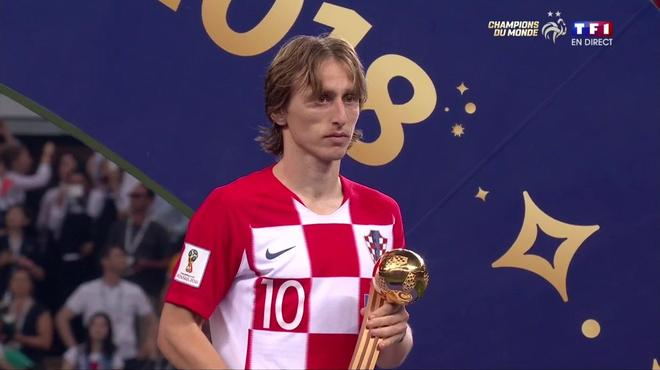
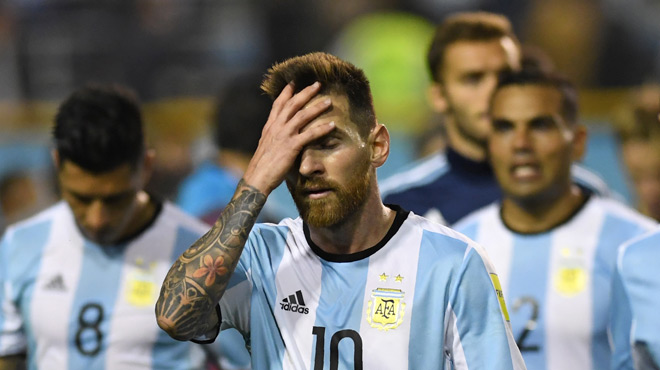
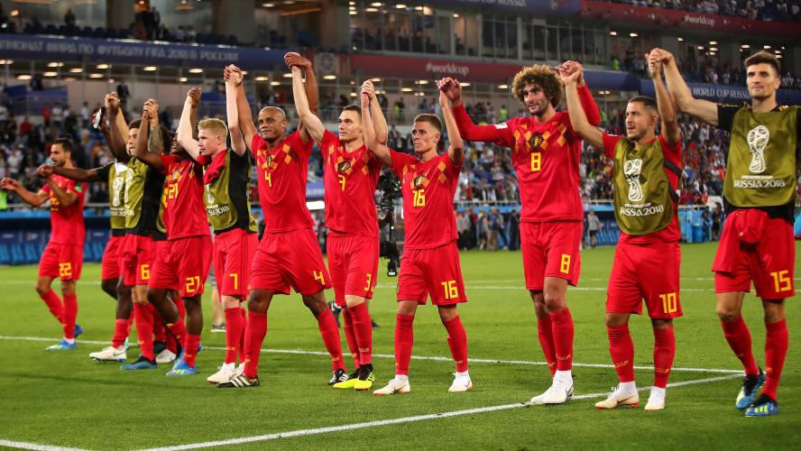
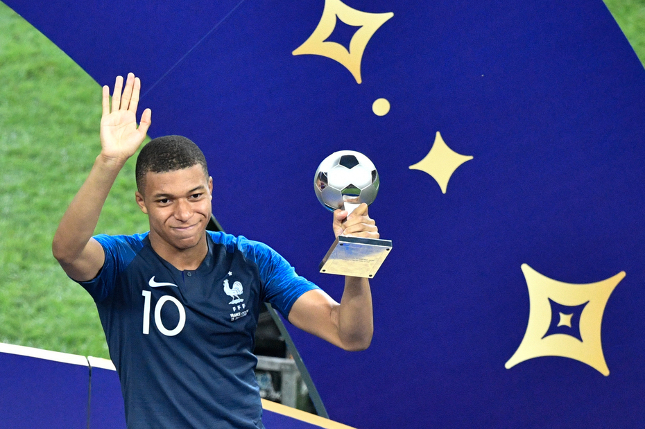

# Rétro Champions du Monde

#### L'idée de cette rétro était bien évidemment de surfer sur la victoire de l'équipe de France de foot en 2018 et de l'adapter en rétro. A faire avec au moins 1 ou 2 footeux, sinon ça tombe à l'eau.

### Intro

En introduction, lancer un petit ballon de foot et proposer de donner son mood en un mot.

### Corps de la rétro
Les catégories sont :
- **France -** Les victoires 

- **Croatie -** Les défaites

- **Argentine -** Ce qui a été moche

- **Belgique -** Ce qui a été prometteur

- **Le meilleur... de la compétition** : Chacun peut donner une "récompense" à quelqu'un ou qqchose. 

Ex : 
La meilleure boulette : Jean-Louis
Le meilleur emploi fictif : le serveur de préprod

### Conclusion de la rétro
0
La partie "Le meilleur..." peut être gardée en fermeture de rétro.

