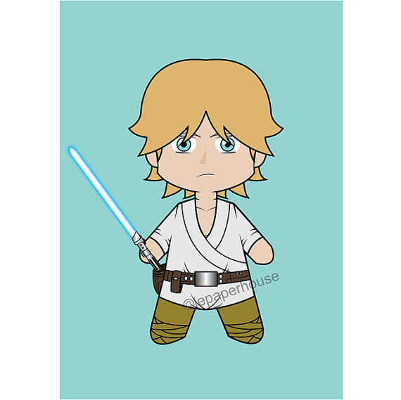

# Rétro Star Wars

#### L'idée de cette rétro vient du site [CultureAgile.com](http://www.culture-agile.com/la-retrospective-agile-star-wars/). J'y ai ajouté ma touche perso !

### Intro

En fond musical [la BO de Star Wars](https://www.youtube.com/watch?v=_D0ZQPqeJkk) évidemment !
J'ai distribué en fil rouge des citations de Star Wars que chacun devait placer au cours de la rétro.

La question d'intro était : "Quel personnage de Star Wars te représenterait le mieux lors de cette rétro ?" (Important pour la suite : chacun doit en prendre un différent). 

### Corps de la rétro
Les catégories sont :
- **Côté clair de la Force** - Les choses positives

- **Côté obscur de la Force** - Les choses négatives

Ensuite, on choisit sur quels sujets prendre des actions et on les classe selon leur type : 

-  Action **R2D2** : de type « courage »

-  Action **Leïa**: de type « diplomatie »

-  Action **Luke Skywalker** : de type « apprentissage »

-  Action **Yoda** : de type « conseil / aide »

Les participants peuvent ainsi s'attribuer les actions en fonction de leur affinité avec l'un des personnages, ou du type.

### Conclusion de la rétro
En jeu de fin, je demande aux participants de se mettre en cercle. Et je demande à tous : "En quoi X est-il un jedi pour l'équipe ?". Chacun peut répondre et on passe au suivant. Cela permet de terminer sur une note de feedbacks positifs.
>Après la rétro, j'ai fait un poster avec chaque personnage choisi en intro, et le nom de la personne en légende, qu'ils ont pu garder en souvenir.

